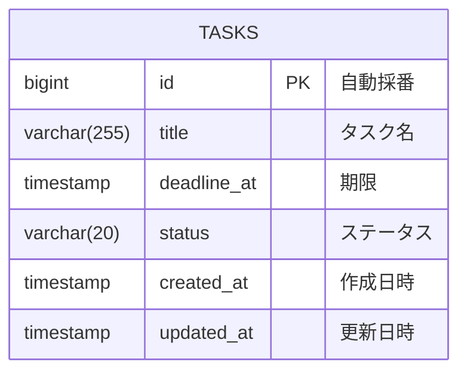
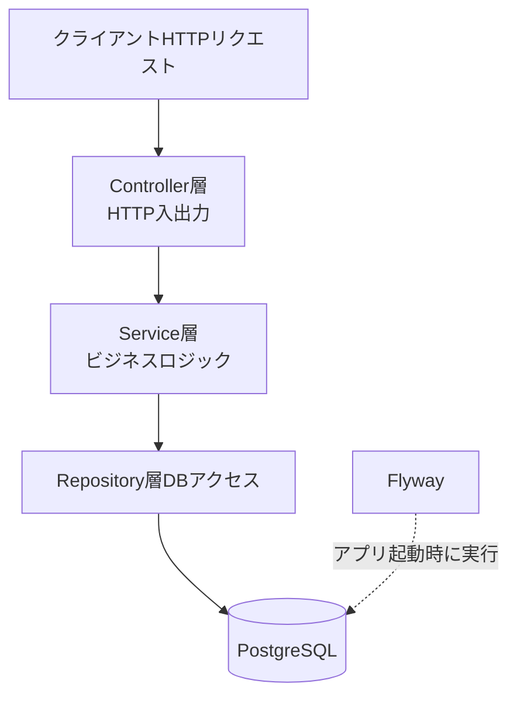

# todo-app

## 概要
> Spring Boot + PostgreSQL で作ったタスク管理API

Java/Springの実践的な理解を深めるため、タスク管理APIを開発。
レイヤードアーキテクチャ・テスト駆動開発・マイグレーション管理など、
開発現場で求められる設計と運用を意識して構築しています。

## 機能一覧
- タスクを登録する（タイトル・期限）
- タスクのステータスを変更する（未着手 / 進行中 / 完了 / 期限切れ）
- タスクの期限を変更する
- 登録されたタスクを一覧表示する

## API一覧

| メソッド   | エンドポイント              | 説明         　 |
|--------|----------------------|--------------|
| POST   | /tasks               | タスクを新規登録     |
| GET    | /tasks               | タスク一覧を取得     |
| PATCH  | /tasks/{id}/deadline | タスクの期限を変更    |
| PUT    | /tasks/{id}/complete | タスクを完了状態にする  |
| delete | /tasks/{id}          | タスクを削除       |

## 使用技術

### バックエンド
- **言語**：Java 21
- **フレームワーク**：Spring Boot 3.5.9
- **ORマッパー**：Spring Data JPA / Hibernate
- **マイグレーション**：Flyway 11
- **バリデーション**：Spring Validation
- **コード簡素化**：Lombok

### フロントエンド
- **テンプレートエンジン**：Thymeleaf
- HTML / CSS

### データベース
- **本番想定**：PostgreSQL 16
- **テスト用**：H2 (インメモリ)

### インフラ・ツール
- **コンテナ**：Docker Compose
- **ビルドツール**：Gradle (Kotlin DSL)
- **JDK管理**：Eclipse Adoptium 21

## ER図


## アーキテクチャ図



### 各層の責務
- **Controller**：HTTPリクエストの受付とレスポンスの返却。ビジネスロジックは持たない
- **Service**：ビジネスロジックを集約。トランザクション境界もここで定義
- **Repository**：データベースアクセス。Spring Data JPAを利用

## セットアップ手順
### 前提条件
- Java 21
- Docker Desktop
- Git

### 起動方法

```bash
# 1. リポジトリをクローン
git clone https://github.com/095548/todo-app.git
cd todo-app

# 2. PostgreSQLを起動
docker compose up -d

# 3. アプリケーションを起動
./gradlew bootRun
```

起動後、`http://localhost:8080` でアクセスできます。

## 今後の改善予定

- [ ] DELETE エンドポイントの追加
- [ ] DTO の導入（Request/Response の分離）
- [ ] `@RestControllerAdvice` による例外ハンドリングの統一
- [ ] テストコードの拡充
- [ ] OpenAPI（Swagger）でのAPI仕様書自動生成
- [ ] React フロントエンドの追加